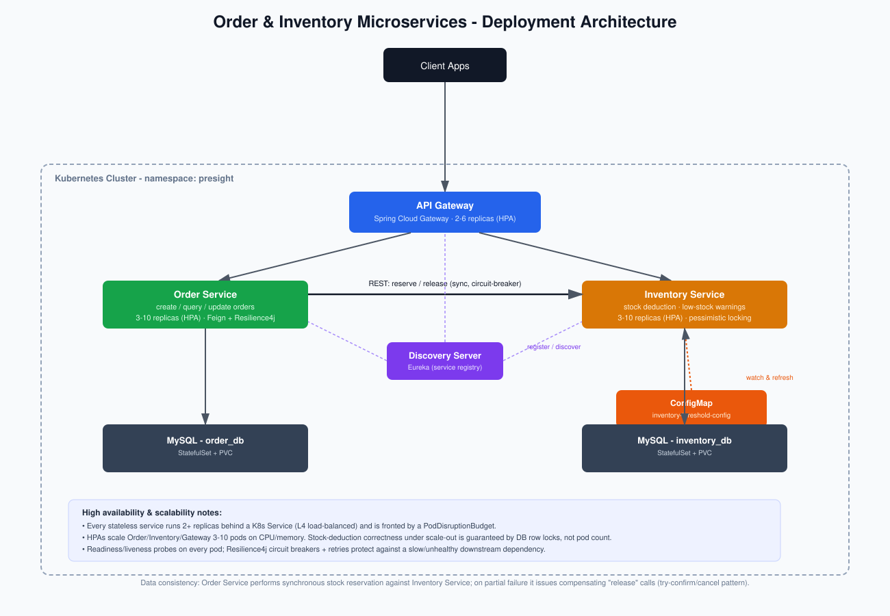

# Order & Inventory Microservices System 

A highly-available, horizontally-scalable order/inventory platform built with Spring
Boot and Spring Cloud, containerized with Docker and deployable to Kubernetes.

Developed by Santosh Haller(Senior Software Engineer)

## What's in here

| Module | Purpose | Port |
|---|---|---|
| `discovery-server` | Eureka service registry | 8761 |
| `api-gateway` | Spring Cloud Gateway — single entry point, routing, circuit-breaking | 8080 |
| `order-service` | Order creation, querying, cancellation | 8081 |
| `inventory-service` | Product catalogue, stock reservation, low-stock alerting | 8082 |
| `k8s/` | Namespace, ConfigMap, Secrets, RBAC, StatefulSets, Deployments, HPAs, Ingress | — |
| `docker-compose.yml` | Full local stack for manual/end-to-end testing | — |
| `docs/architecture-diagram.svg` | Deployment & architecture diagram | — |
| `scripts/smoke-test.sh` | curl-based happy-path + failure-path test | — |

Each service is an independent Maven project with its own `pom.xml` and `Dockerfile` —
this mirrors how these would actually be built/deployed independently in CI, each with
its own release cadence, rather than a single monolithic multi-module build.

---

## Architecture



Client → Ingress → API Gateway → {Order Service, Inventory Service} → MySQL (one
database per service). Order Service and Inventory Service register with, and discover
each other through, Eureka, so the Gateway and Order Service never hard-code a
downstream host — they load-balance across however many replicas happen to be healthy.

### Why database-per-service

Order and Inventory own separate schemas (`order_db`, `inventory_db`), each with its
own StatefulSet in Kubernetes. This is deliberate: it keeps each service independently
deployable and stops one team's schema migration from taking down the other service. The
cost is that we can no longer rely on a single ACID transaction to keep an order and its
stock reservation consistent — which is the next section.

---

## Data Consistency Strategy (Order ↔ Inventory)

This is the crux of the assessment, so it's worth spelling out the reasoning.

**Options considered:**

1. **Two-phase commit / distributed transaction** — rejected. Requires a DTC/XA
   coordinator, couples both services' availability together, and is generally
   considered an anti-pattern for microservices at this scale.
2. **Fully asynchronous saga over a message broker** (e.g. Kafka, RabbitMQ) — the
   "textbook" answer for eventual consistency, and what I'd genuinely reach for in
   production. Deliberately **not** implemented here to keep the deliverable within
   the assessment's explicit tech list (Spring Boot, Spring Cloud, REST) and its
   scope — but the design below is structured so it's a mechanical swap: replace the
   synchronous Feign call with an event publish, and the compensation logic becomes a
   listener instead of a direct call.
3. **Synchronous orchestration with compensating transactions** ("try-confirm/cancel")
   — what's implemented. Order Service acts as the orchestrator:

```
1. POST /api/v1/orders received → Order persisted as PENDING
2. For each line item:
     Order Service --REST--> Inventory Service: POST /reserve
     Inventory Service locks the product row (pessimistic write lock),
     checks quantity, deducts if sufficient, returns success/failure
3. If ALL reservations succeed → Order marked CONFIRMED
4. If ANY reservation fails   → Order Service issues POST /release for every
                                 item it successfully reserved so far
                                 (compensating transaction), then marks the
                                 Order FAILED with a reason
```

This gives atomicity of the *business outcome* (an order is either fully stocked or
fully rolled back) without a distributed transaction. The trade-off is that order
placement latency now includes N sequential calls to Inventory Service — acceptable
here because the caller is a synchronous, user-facing request that expects an
immediate answer, and N (line items per order) is small in practice.

**Resilience around the synchronous call** (`OrderService.reserveStock`):
- Resilience4j `@Retry` — retries transient network failures (timeouts, connection
  resets) up to 3 times with backoff.
- Resilience4j `@CircuitBreaker` — if Inventory Service is failing repeatedly, the
  breaker opens and subsequent calls fail fast (`reserveFallback`) instead of piling
  up threads waiting on a socket timeout, protecting Order Service under a downstream
  outage.
- Compensating `release()` calls are logged loudly (`COMPENSATION FAILED`) if they
  themselves fail, flagging the case for manual reconciliation rather than silently
  losing stock — a known edge case of the try-confirm/cancel pattern without a durable
  outbox.

**Concurrency inside Inventory Service** (`InventoryService.reserve` /
`ProductRepository.findBySkuForUpdate`): stock deduction uses a `PESSIMISTIC_WRITE`
row lock, so concurrent reservations against the *same SKU* are serialized at the
database rather than racing in application memory. An `@Version` column is also present
as a secondary defense. This is what keeps oversell impossible even with 10 Inventory
Service pods handling a flash-sale-style spike on one product.

---

## Low-stock warning via dynamic ConfigMap

`InventoryProperties` (`@ConfigurationProperties(prefix = "inventory")`,
`@RefreshScope`) holds the global `low-stock-threshold`. In Kubernetes,
`spring-cloud-starter-kubernetes-client-config` watches the
`inventory-threshold-config` ConfigMap (`k8s/01-configmap.yaml`) via the Kubernetes
API and fires a refresh event on change — so:

```bash
kubectl patch configmap inventory-threshold-config -n presight --type merge -p '{\"data\":{\"low-stock-threshold\":\"25\"}}'
kubectl get configmap inventory-threshold-config -n presight -o yaml
# change low-stock-threshold: "10" -> "25"
```

...takes effect on every running `inventory-service` pod within a few seconds, **no
restart required**. This needs read access to ConfigMaps, which is why
`k8s/03-rbac.yaml` grants a scoped `Role`/`RoleBinding` to a dedicated
`inventory-service-sa` ServiceAccount rather than widening the namespace default.

Every stock reservation checks the (possibly per-product-overridden) threshold and logs
a `WARN`-level line when the remaining quantity drops to or below it — this is what a
log-based alert (CloudWatch metric filter, Loki/Grafana alert rule, etc.) would hook
into in production. `GET /api/v1/inventory/low-stock` also surfaces the current list
for a dashboard or ops script to poll.

---

## API Reference

All requests go through the gateway at `http://localhost:8080` (or your Ingress host).

### Orders
| Method | Path | Description |
|---|---|---|
| POST | `/api/v1/orders` | Create an order (reserves stock synchronously) |
| GET | `/api/v1/orders/{orderReference}` | Get a single order |
| GET | `/api/v1/orders?customerId=...` | List orders (optionally by customer) |
| POST | `/api/v1/orders/{orderReference}/cancel` | Cancel an order, releasing stock |

### Inventory
| Method | Path | Description |
|---|---|---|
| POST | `/api/v1/inventory/products` | Add a product |
| GET | `/api/v1/inventory/products` | List all products |
| GET | `/api/v1/inventory/products/{sku}` | Get a product |
| GET | `/api/v1/inventory/low-stock` | List products at/below threshold |
| POST | `/api/v1/inventory/reserve` | Deduct stock (called by Order Service) |
| POST | `/api/v1/inventory/release` | Restore stock (compensating action) |
| PUT | `/api/v1/inventory/products/{sku}/replenish?quantity=N` | Restock |

Swagger UI per service: `/swagger-ui.html` (also reachable through the gateway at
`/docs/orders/swagger-ui.html` and `/docs/inventory/swagger-ui.html`).


---

## Running locally with Docker Compose

```bash
docker compose up --build
# Gateway:    http://localhost:8080
# Eureka UI:  http://localhost:8761
# Order DB:   localhost:3307
# Inventory DB: localhost:3308


```

Bring up multiple order-service / inventory-service instances to see load-balancing
in action:
```bash
docker compose up --build --scale order-service=3 --scale inventory-service=3
```

## Running on Kubernetes

Manifests are plain YAML (numbered so `kubectl apply -f k8s/` applies them in a sane
order); a Helm chart wrapping the same resources is a natural next step but out of
scope here given the "or" in the assessment brief.

```bash
# Build images (or push to a registry your cluster can pull from)
docker build -t presight/discovery-server:1.0.0 ./discovery-server
docker build -t presight/api-gateway:1.0.0      ./api-gateway
docker build -t presight/order-service:1.0.0    ./order-service
docker build -t presight/inventory-service:1.0.0 ./inventory-service

# If using a local cluster (kind/minikube), load the images:
kind load docker-image presight/discovery-server:1.0.0 presight/api-gateway:1.0.0 \
  presight/order-service:1.0.0 presight/inventory-service:1.0.0

kubectl apply -f k8s/

kubectl get pods -n presight -w

kubectl port-forward -n presight svc/api-gateway 8080:8080

```

Scale a service manually or watch the HPA do it:
```bash
kubectl scale deployment inventory-service -n presight --replicas=6
kubectl get hpa -n presight -w
```

Update the low-stock threshold live:
```bash
kubectl patch configmap inventory-threshold-config -n presight --type merge -p '{\"data\":{\"low-stock-threshold\":\"25\"}}'
```

---

## High availability & scalability design choices

- **Stateless services, horizontally scaled**: Order, Inventory and Gateway hold no
  in-memory session state, so any replica can serve any request. Each has an HPA
  (3–10 pods for Order/Inventory, 2–6 for the Gateway) scaling on CPU/memory.
- **PodDisruptionBudgets** on Order and Inventory ensure a voluntary disruption (node
  drain, rolling upgrade) never takes availability below 2 replicas.
- **Readiness/liveness probes** on every deployment so Kubernetes stops routing to a
  pod that's still starting up or has become unhealthy, and restarts pods that hang.
- **Correctness under concurrency is a database-locking problem, not a pod-count
  problem** — see the pessimistic-lock discussion above. This is what actually lets
  Inventory Service scale out safely.
- **Circuit breakers + retries** at both the Gateway (Order/Inventory routes) and
  inside Order Service (its Feign client to Inventory) stop a slow downstream
  dependency from cascading into thread/connection exhaustion upstream.
- **Service discovery via Eureka** means scaling a service up/down never requires
  reconfiguring or redeploying the services that call it.

## Production considerations (explicitly out of scope for this assessment)

Being upfront about what a real production rollout would add on top of this:
- Managed, replicated databases (RDS Multi-AZ / Cloud SQL HA) instead of a single-pod
  MySQL StatefulSet — the StatefulSet here is fine for a demo/interview but is a
  single point of failure for the data tier.
- A message broker (Kafka/RabbitMQ) based saga with an outbox table, replacing the
  synchronous reserve/release calls, to fully decouple Order and Inventory
  availability from one another and give durable, replayable compensation.
- Eureka itself as a peer-aware cluster (or swap for Kubernetes-native service
  discovery, since a K8s `Service` already does most of what Eureka does — kept
  Eureka here specifically because the brief called out Spring Cloud).
- mTLS between services (e.g. via a service mesh) and a proper API Gateway auth layer
  (OAuth2/JWT) — none of these endpoints are authenticated right now.
- Centralized logging/tracing (ELK or Loki + Tempo/Jaeger) wired up to the
  `X-Correlation-Id` header the Gateway already stamps on every request.
- A Helm chart (or Kustomize overlays) for per-environment config instead of editing
  raw manifests.

## Testing

Each service has unit tests for its core business logic under `src/test`:
- `InventoryServiceTest` — reservation success/failure, insufficient stock, release.
- `OrderServiceTest` — order confirmation, and the failure + compensation path
  (verifies `release()` is called for a previously-reserved item when a later item in
  the same order fails).

```bash
cd order-service && mvn test
cd inventory-service && mvn test
```

## Tech stack

Java 17 · Spring Boot 3.2 · Spring Cloud 2023.0 (Netflix Eureka, Gateway, OpenFeign,
Kubernetes Config) · Resilience4j · Spring Data JPA · MySQL 8 / H2 · Lombok ·
springdoc-openapi · Docker · Kubernetes (Deployments, StatefulSets, HPA, PDB, RBAC,
Ingress)
